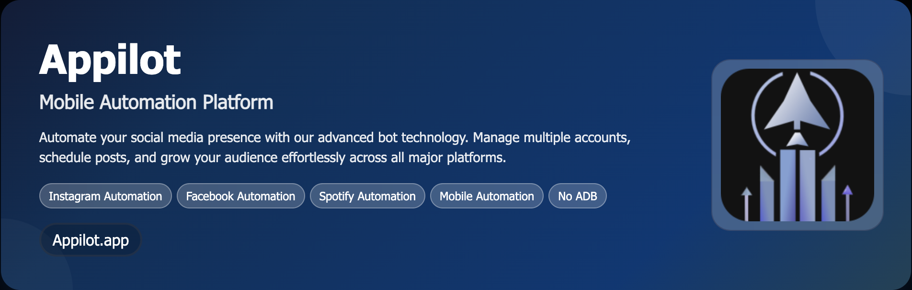

# **Instagram Automation Bot**

>This bot is designed to work on Android devices and ensures optimal performance by rotating proxies and simulating natural user activity to avoid detection by Instagram’s anti-bot systems.

<p align="center">
  <a href="https://bitbash.dev" target="_blank">
    
  </a>
</p>
<p align="center">
  <a href="https://t.me/devpilot1" target="_blank">
    
  </a>&nbsp;
  <a href="https://wa.me/923249868488?text=Hi%20Zeeshan%2C%20I'm%20interested%20in%20automation." target="_blank">
    
  </a>&nbsp;
  <a href="mailto:support@appilot.app" target="_blank">
    
  </a>&nbsp;
  <a href="https://appilot.app" target="_blank">
    
  </a>
</p>


## **Introduction**
The **Instagram Automation Bot** is a fully automated solution designed to run multiple Instagram accounts on real Android devices. This bot mimics human-like behavior for tasks such as account creation, login, posting, messaging, following, unfollowing, liking, commenting, and story viewing. The bot is powered by **Appium** and **Appilot** for seamless remote device control, making it fully wireless without needing ADB or USB connections.


## **Why Use the Instagram Automation Bot?**
- **Increase Engagement**: Automatically follow/unfollow, comment, like posts, and view stories to boost user interaction and engagement.
- **Save Time**: Automate repetitive tasks such as messaging, posting, and account management.
- **Scalable Automation**: Easily scale your automation efforts by managing multiple accounts per device.
- **Human-Like Interaction**: Simulate real user behavior to prevent detection by Instagram's anti-bot algorithms.
- **Proxy Rotation**: Utilize rotating proxies for each action to ensure privacy and avoid IP blocks.

---

## **Features**
| **Feature**                    | **Description**                                                                              |
|---------------------------------|----------------------------------------------------------------------------------------------|
| **Multiple Accounts per Device**| Run multiple Instagram accounts on a single Android device.                                 |
| **Human-Like Behavior**         | Automate actions like following, commenting, liking, and story viewing with randomized delays.|
| **Proxy Rotation**              | Automatically rotate proxies for each action to maintain anonymity and avoid detection.       |
| **Content Scheduling**          | Schedule posts, comments, and interactions to be posted at optimal times.                    |
| **Advanced Targeting**          | Target specific users based on hashtags, location, and followers.                            |
| **Real-Time Tracking**          | Track and mirror actions in real-time, providing feedback on automated tasks.                |
| **Detailed Analytics**          | Get insights into the actions performed, including likes, follows, and comments, along with performance reports. |


</p>
<p align="center">
  <a href="https://bitbash.dev" target="_blank">
    
  </a>
</p>

---

## **Technologies Used**
- **Appium**: For mobile automation across Android and iOS devices.
- **Appilot**: Wireless Android automation without requiring ADB or USB connections.
- **Node.js**: Backend runtime environment for automation scripts.
- **JavaScript/TypeScript**: The primary language for automating Instagram tasks.
- **Proxy Rotation**: Rotates proxies automatically to prevent detection and maintain anonymity.
- **SQLite**: Stores bot actions, logs, and tracking data locally for monitoring.

---

## **Key Bot Actions**

- **Follow Users**: Automates following users based on specific targeting like hashtags or location.

- **Like Posts**: Automates liking posts by users in your target audience.

- **Comment on Posts**: Automates commenting on targeted posts.

- **View Stories**: Simulate views on Instagram stories to enhance engagement.

- **Send DMs**: Automatically send direct messages to users based on specific filters.

---

## **Project Structure**

```
instagram-automation-bot/
├── src/
│   ├── index.js              # Main entry point for bot execution
│   ├── instagramBot.js       # Core Instagram automation logic
│   ├── proxyManager.js       # Handles proxy management and rotation
│   ├── actionHandler.js      # Defines Instagram tasks (like, follow, comment)
│   └── utils/
│       ├── logger.js         # Logging utility for debugging and monitoring
│       ├── delay.js          # Helper functions to simulate human-like delays
│       └── database.js       # Manages interaction logs and tracking data
├── config/
│   ├── appilotConfig.json    # Appilot device and automation configuration
│   └── proxies.json          # Proxy list for rotation
├── data/
│   ├── input.json            # List of Instagram accounts to automate
│   ├── output.json           # Logs of actions performed by the bot
│   └── logs/
│       └── run-2025-10-21.log # Log files for bot run details
├── tests/
│   ├── instagramBot.test.js  # Unit tests for Instagram bot actions
├── package.json              # Node.js dependencies and configurations
├── README.md                 # Documentation for project setup and usage
├── LICENSE                   # Project license
└── .gitignore                # Git ignore configuration for sensitive files

```

## **Installation Guide**

### **Prerequisites**
Ensure that you have the following installed:
- **Node.js** (version 14 or higher)
- **Appium**: For Android automation (see [Appium Documentation](https://appium.io/docs/en/about-appium/intro/)).
- **Appilot**: For wireless Android automation (set up via [Appilot Documentation](https://appilot.app/)).

### **Step 1: Clone the Repository**
First, clone the repository to your local machine:
```bash
git clone https://github.com/yourusername/instagram-automation-bot.git
cd instagram-automation-bot
```

---

<p align="center">
<a href="https://calendar.app.google/GyobA324GxBqe6en6" target="_blank">
  
</a>
</p>


<table>
  <tr>
    <td align="center" width="33%" style="padding:10px;">
      
      <p style="font-size:14px; line-height:1.5; color:#444; margin:0 15px;">
        “This scraper helped me gather thousands of Facebook posts effortlessly.  
        The setup was fast, and exports are super clean and well-structured.”
      </p>
      <p style="margin:10px 0 0; font-weight:600;">Nathan Pennington  
        <br><span style="color:#888;">Marketer</span>  
        <br><span style="color:#f5a623;">★★★★★</span>
      </p>
    </td>
    <td align="center" width="33%" style="padding:10px;">
      
      <p style="font-size:14px; line-height:1.5; color:#444; margin:0 15px;">
        “What impressed me most was how accurate the extracted data is.  
        Likes, comments, timestamps — everything aligns perfectly with real posts.”
      </p>
      <p style="margin:10px 0 0; font-weight:600;">Greg Jeffries  
        <br><span style="color:#888;">SEO Affiliate Expert</span>  
        <br><span style="color:#f5a623;">★★★★★</span>
      </p>
    </td>
    <td align="center" width="33%" style="padding:10px;">
      
      <p style="font-size:14px; line-height:1.5; color:#444; margin:0 15px;">
        “It’s by far the best Facebook scraping tool I’ve used.  
        Ideal for trend tracking, competitor monitoring, and influencer insights.”
      </p>
      <p style="margin:10px 0 0; font-weight:600;">Karan  
        <br><span style="color:#888;">Digital Strategist</span>  
        <br><span style="color:#f5a623;">★★★★★</span>
      </p>
    </td>
  </tr>
</table>

